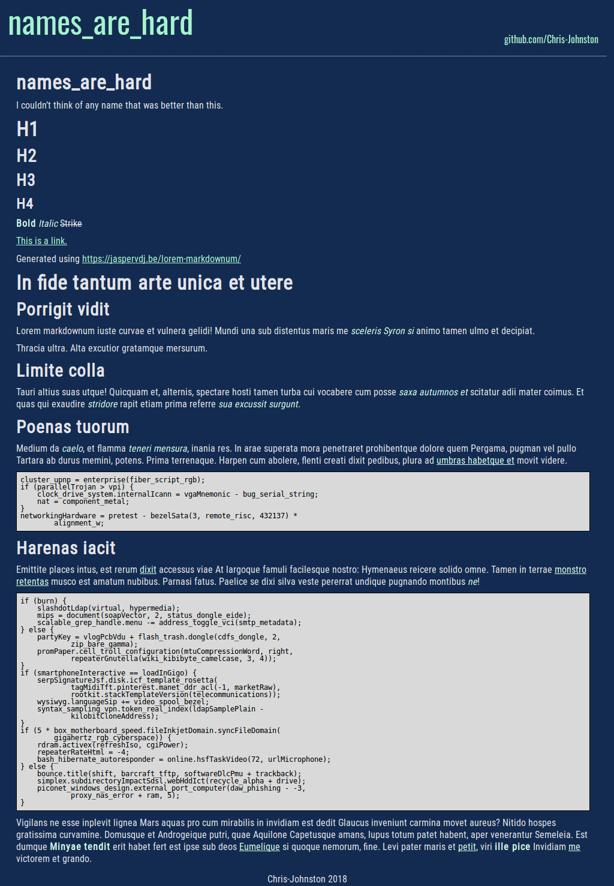

# names_are_hard

[](https://badge.fury.io/rb/names_are_hard)

This is a theme that is used for https://chris-johnston.me




## Installation

Add this line to your Jekyll site's `Gemfile`:

```ruby
gem "names_are_hard"
```

And add this line to your Jekyll site's `_config.yml`:

```yaml
theme: names_are_hard
```

And then execute:

    $ bundle

Or install it yourself as:

    $ gem install names_are_hard

## Usage

Layouts:
  - `boring`: A plain, monospace page.
  - `home`: A home page, that has a header and shows the content of the homepage.
  - `homeposts`: Same as home, but includes the past 3 posts on the bottom of the page header.
  - `page`: Shows the content of a single page, but with no title bar.
  - `plainhtml`: A plain HTML page.
  - `post`: Shows the content of a single page, but with a title bar.

Tags:
  The `project` tag can be applied to group posts into the list
  of projects.

Sass:
  - `names_are_hard.scss` is the main style file.

## Contributing

Bug reports and pull requests are welcome on GitHub at https://github.com/Chris-Johnston/names_are_hard.

## Development

To set up your environment to develop this theme, run `bundle install`.

Your theme is setup just like a normal Jekyll site! To test your theme, run `bundle exec jekyll serve` and open your browser at `http://localhost:4000`. This starts a Jekyll server using your theme. Add pages, documents, data, etc. like normal to test your theme's contents. As you make modifications to your theme and to your content, your site will regenerate and you should see the changes in the browser after a refresh, just like normal.

When your theme is released, only the files in `_layouts`, `_includes`, `_sass` and `assets` tracked with Git will be bundled.
To add a custom directory to your theme-gem, please edit the regexp in `names_are_hard.gemspec` accordingly.

## License

The theme is available as open source under the terms of the [MIT License](https://opensource.org/licenses/MIT).